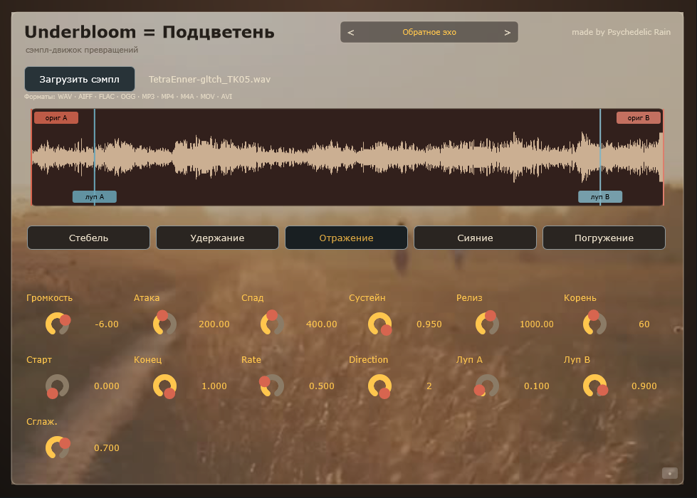

# Underbloom (Подцветень)

**Креативный сэмпл-инструмент** для Windows (VST3 / Standalone): загрузи любой звук
и преобразуй его через пять движков — от гранулярного облака до звенящих резонаторов.

Автор: **Psychedelic Rain** · Версия **0.3.0** · **Бесплатно** (freeware)

> *A creative sample-mangling instrument: load any sound and reshape it through
> five engines — granular cloud, ringing resonators, timestretched drift and more.
> Windows, VST3 / Standalone. Freeware.*

---

## Превью

<video src="https://github.com/PsyRain/VST-Underbloom/raw/master/assets/Underbloom_demo.mp4" controls width="100%"></video>

---

## ✨ Режимы

| Режим | Характер |
|---|---|
| **Стебель** | Базовый сэмплер с плавным лупом и кроссфейдом |
| **Удержание** | Гранулярный sustain — звук «зависает» облаком зёрен |
| **Отражение** | Луп / реверс / ping-pong с переменным темпом |
| **Сияние** | Банк звенящих резонаторов на гармониках ноты (колокол, стекло) |
| **Погружение** | Тайм-стретч дрейф: playhead медленно блуждает в выбранной зоне |

## 🎛 Пресеты

По 3 заводских пресета на каждый режим (15 всего) + сохранение собственных в
`Documents\Underbloom\Presets\<Режим>\`.
В шапке: листать стрелками `◀ ▶`, клик по имени — меню выбора / сохранения / удаления.

## 📂 Поддерживаемые форматы

- **Аудио:** WAV, AIFF, FLAC, OGG, MP3
- **Видео (только аудиодорожка):** MP4, M4A, MOV, AVI

Drag-and-drop или кнопка загрузки. Извлечение из видео — однократно при загрузке.

---

## ⬇️ Скачать

Последняя версия — на вкладке **[Releases](../../releases)**:
скачайте `Underbloom_v030_Setup.exe` и запустите от имени администратора.

## 🛠 Установка

Инсталлятор сам кладёт VST3 в `C:\Program Files\Common Files\VST3\` (можно выбрать
другую папку) и устанавливает Standalone-версию. После установки
**пересканируйте плагины и полностью перезапустите DAW**.

*Вручную:* скопируйте папку `Underbloom.vst3` в `C:\Program Files\Common Files\VST3\`.

## 💻 Требования

Windows 10 / 11, 64-bit. Хост с поддержкой VST3 (FL Studio и др.).
Standalone-версия работает без DAW.

## ❓ FAQ

Частые вопросы — см. **[FAQ.md](FAQ.md)**.

---

## 📋 Лицензия и кредиты

Бесплатно (freeware) — см. [LICENSE.txt](LICENSE.txt).
Создано с помощью [JUCE](https://juce.com).
Сторонние компоненты и уведомления — см. [THIRD_PARTY_NOTICES.txt](THIRD_PARTY_NOTICES.txt).

© 2026 Psychedelic Rain
